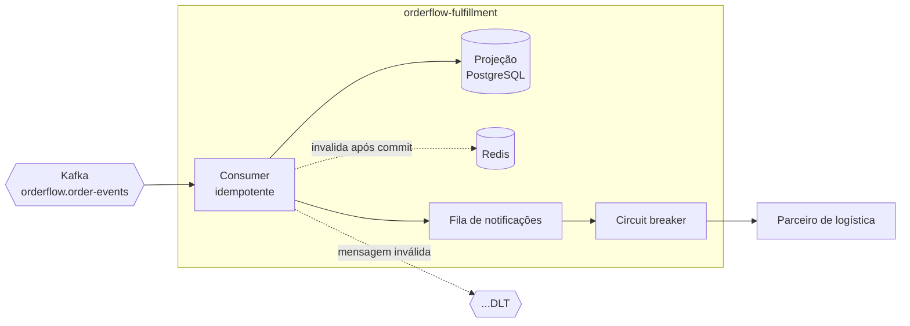

# OrderFlow Fulfillment

[](https://github.com/BrunoBergamin/orderflow-fulfillment/actions/workflows/ci.yml)


Serviço de pós-venda que consome os eventos publicados pelo
[orderflow](https://github.com/BrunoBergamin/orderflow), mantém a própria visão dos pedidos
e avisa o parceiro de logística.

Fiz este depois de terminar o serviço de pedidos porque percebi que tinha aprendido só
metade do assunto. Publicar evento é a parte fácil. O trabalho de verdade começa do outro
lado da fila.

---

## As três perguntas do lado do consumidor

### E quando a mesma mensagem chega duas vezes?

Chega. Rebalanceamento de consumidores, timeout no commit de offset, reentrega do produtor —
o Kafka entrega *pelo menos uma vez*, não *exatamente uma vez*. Sem tratamento, o parceiro
recebe duas notificações do mesmo pedido.

Cada evento traz um `eventId` no cabeçalho, e ele vira chave primária da tabela
`processed_event`. Marcar o evento como processado, atualizar a projeção e agendar a
notificação acontecem **na mesma transação** — ou tudo, ou nada.

Isso responde a pergunta que eu achava óbvia no começo: por que não guardar isso no Redis, se
é só uma chave? Porque o Redis não participa da transação e pode perder chaves (despejo por
memória, restart sem persistência). Uma chave perdida aqui é notificação duplicada chegando
no cliente. Cache serve para acelerar leitura, não para garantir correção.

### E quando a mensagem é impossível de processar?

JSON quebrado, tipo de evento desconhecido, cabeçalho faltando. O comportamento padrão do
Spring Kafka é não confirmar o offset e reprocessar — para sempre. Uma única mensagem
defeituosa trava a partição inteira, e **nenhuma mensagem posterior é entregue**. O sistema
parece vivo e simplesmente parou de reagir.

`UnparseableEventException` está registrada como não retentável: vai direto para a DLQ
(`orderflow.order-events.DLT`) e a fila continua andando. Falha transitória — banco
reiniciando, deadlock — essa sim é retentada, com espera crescente.

O teste `mensagemEnvenenadaVaiParaDlq` verifica as duas coisas: a mensagem ruim chega na
DLQ, e a mensagem seguinte é processada normalmente.

### E quando o sistema externo cai?

Retry e circuit breaker resolvem problemas diferentes, por isso os dois convivem no
`PartnerNotificationAdapter`.

O retry cobre o soluço: um timeout isolado, um pacote perdido — tentar de novo em 200ms
resolve. O circuit breaker cobre a queda: quando o parceiro está mesmo fora, insistir é pior
que desistir, porque cada tentativa consome thread deste lado e aumenta a fila do outro.
Passado o limiar de erros o circuito abre, as chamadas falham na hora sem tocar a rede, e
depois da janela de espera ele testa sozinho se o outro lado voltou.

Nada se perde nesse meio-tempo: as notificações recusadas voltam para a tabela com o
intervalo exponencial calculado pelo domínio, e saem quando o parceiro voltar.

---

## Rodando

Precisa do serviço de pedidos no ar primeiro — é ele que cria a rede e o Kafka.

```bash
git clone https://github.com/BrunoBergamin/orderflow.git
cd orderflow && docker compose up -d

cd .. && git clone https://github.com/BrunoBergamin/orderflow-fulfillment.git
cd orderflow-fulfillment && docker compose up --build
```

Swagger em http://localhost:8081/swagger-ui.html, estado dos circuitos em
`/actuator/circuitbreakers`.

Para ver os dois conversando, crie um pedido na porta 8080 e consulte aqui na 8081:

```bash
TOKEN=$(curl -s -X POST http://localhost:8080/api/v1/auth/login \
  -H 'Content-Type: application/json' \
  -d '{"email":"cliente@orderflow.dev","password":"cliente123"}' | jq -r .accessToken)

PRODUTO=$(curl -s http://localhost:8080/api/v1/products | jq -r '.content[0].id')
PEDIDO=$(curl -s -X POST http://localhost:8080/api/v1/orders \
  -H "Authorization: Bearer $TOKEN" -H 'Content-Type: application/json' \
  -d "{\"items\":[{\"productId\":\"$PRODUTO\",\"quantity\":1}]}" | jq -r .id)

# Segundos depois o pedido já existe aqui, sem nenhuma chamada entre os serviços
curl -s -H 'X-API-Key: chave-de-demonstracao' \
  http://localhost:8081/api/v1/orders/$PEDIDO | jq
```

Suba com `PARTNER_AVAILABLE=false` para ver o circuito abrir.

---

## Desenho



Os dois serviços não compartilham banco nem biblioteca de modelo. O único acoplamento é o
contrato do JSON no tópico, e o parser lê **só os campos que usa** — o produtor pode
adicionar campos novos sem quebrar nada aqui. Um "commons" com o modelo de eventos pareceria
economia, mas transformaria qualquer mudança num release coordenado dos dois.

---

## Outras decisões

**A projeção é local, não uma consulta ao outro serviço.** Perguntar ao produtor a cada
leitura recria o acoplamento em tempo de execução: se ele cai, este cai junto. O preço é
consistência eventual — há uma janela de segundos em que a projeção está atrás da origem.
Para acompanhamento de pedido isso é aceitável; para autorizar pagamento não seria.

**O cache é invalidado depois do commit, nunca durante.** Invalidando no meio da transação
existe uma janela real: outra requisição lê o banco (ainda com o valor antigo, porque nada
commitou), repovoa o cache, e o dado velho fica servido até o TTL vencer. `evictAfterCommit`
registra a limpeza numa `TransactionSynchronization`.

**Nenhuma falha do Redis derruba requisição.** Se o cache estiver fora, a leitura vai ao
banco. Um cache que consegue causar erro 500 é ponto único de falha novo, não otimização.

**Lease na fila de notificações.** O `SKIP LOCKED` impede duas instâncias de pegarem a mesma
linha, mas o lock morre no fim da transação — que termina antes de a entrega começar, já que
a chamada externa é feita fora de transação. Por isso a reserva também empurra o
`next_attempt_at` para frente: a linha fica invisível durante a entrega. Se o processo morrer
no meio, o lease expira e ela volta a ser tentada.

**Chave de API em vez de JWT.** Quem consome este serviço são outros sistemas, não pessoas —
não há usuário final para autorizar. A comparação usa `MessageDigest.isEqual`, que percorre
todos os bytes; um `equals` comum retorna mais rápido quanto mais cedo diverge, e essa
diferença de tempo permite descobrir a chave caractere a caractere.

**O `switch` sobre os eventos não tem `default`.** `OrderEvent` é uma `sealed interface`, e
o compilador exige que todos os casos sejam tratados. Se um evento novo entrar no contrato,
o build aponta cada ponto que precisa decidir o que fazer com ele — em vez de o evento cair
num ramo genérico e ninguém perceber.

---

## Testes

```bash
./mvnw test      # 35 testes, ~15s, não precisa de Docker
./mvnw verify    # + 15 de integração (PostgreSQL e Redis reais, Kafka embarcado)
```

50 no total. O que mais me deu trabalho para deixar honesto foi o do cache: depois da
primeira consulta, o teste **apaga a linha do PostgreSQL**. Se a resposta seguinte ainda
vier, só pode ter vindo do Redis. É a diferença entre "configurei um cache" e "provei que
ele está sendo usado".

As 8 regras do ArchUnit rodam no CI. A que mais importa aqui: Kafka, Redis e Resilience4j
não podem aparecer no domínio nem nos casos de uso. Se aparecerem, trocar de broker ou de
cache vira reescrita de regra de negócio.

---

## Endpoints

Todos exigem `X-API-Key`. Somente leitura — estado de pedido muda na origem e chega aqui
pelos eventos; expor um POST criaria duas fontes de verdade.

| Método | Rota | Descrição |
|---|---|---|
| `GET` | `/api/v1/orders/{orderId}` | Pedido na projeção (via cache quando disponível) |
| `GET` | `/api/v1/orders?customerId=&status=` | Lista paginada |
| `GET` | `/api/v1/notifications?orderId=&status=` | Histórico de entregas, tentativas e erros |

Filtrar por `status=DEAD` responde a pergunta operacional que importa: o que deixou de ser
entregue e precisa de alguém olhando.

---

## Stack

Java 21, Spring Boot 3.5.16, Spring Kafka, PostgreSQL 16 + Flyway, Redis 7, Resilience4j,
Actuator + Prometheus. Testes com JUnit 5, AssertJ, Mockito, Testcontainers, Embedded Kafka,
Awaitility e ArchUnit. Docker multi-stage em camadas e GitHub Actions.

## Os outros dois serviços

- [orderflow](https://github.com/BrunoBergamin/orderflow) — API de pedidos: idempotência,
  lock otimista no estoque e Transactional Outbox
- [orderflow-reconciliation](https://github.com/BrunoBergamin/orderflow-reconciliation) —
  conciliação financeira em lote com Spring Batch

---

**Bruno Alves Bergamin** — back-end Java ·
[LinkedIn](https://www.linkedin.com/in/bruno-alves-bergamin-6b711a347) · Licença MIT
