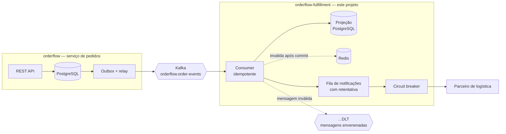

# OrderFlow Fulfillment

Serviço de pós-venda **orientado a eventos**. Consome os eventos publicados pelo
[**OrderFlow**](https://github.com/BrunoBergamin/orderflow), mantém uma projeção de leitura
dos pedidos e entrega notificações a um parceiro externo — com **consumo idempotente**,
**fila de mensagens mortas (DLQ)**, **circuit breaker** e **cache Redis**.

[](https://github.com/BrunoBergamin/orderflow-fulfillment/actions/workflows/ci.yml)


---

## Por que este projeto existe

Publicar um evento é a parte fácil. O trabalho de verdade está no outro lado da fila:
**o que acontece quando a mesma mensagem chega duas vezes, quando uma mensagem é
impossível de processar, e quando o sistema externo que você precisa chamar está fora do
ar.**

Este serviço existe para responder essas três perguntas com código rodando e teste
provando.

| Problema real | Solução aplicada | Onde está provado |
|---|---|---|
| A mesma mensagem chega duas vezes (rebalanceamento, timeout de commit) | Tabela `processed_event` com chave primária, na mesma transação do efeito | `OrderEventsConsumerIT.consumoIdempotente` |
| Uma mensagem defeituosa trava a partição e o sistema para em silêncio | Erro não retentável → DLQ imediata, fila continua andando | `OrderEventsConsumerIT.mensagemEnvenenadaVaiParaDlq` |
| O parceiro externo cai e a aplicação inteira trava tentando alcançá-lo | Circuit breaker + retentativa com espera exponencial | `CircuitBreakerIT` |
| Notificação some quando a entrega falha | Fila em tabela, com tentativas, erro e reagendamento | `CircuitBreakerIT.abreOCircuitoEPreservaAsNotificacoes` |
| Evento reprocessado da DLQ chega fora de ordem e regride o pedido | Guarda de evento obsoleto por `occurredAt` | `OrderSnapshotTest.naoRebaixaStatus` |
| Consulta de status martelando o banco | Cache-aside no Redis, invalidado **após o commit** | `FulfillmentApiIT.segundaConsultaVemDoCache` |

---

## O sistema completo



**Os dois serviços não compartilham banco nem biblioteca de modelo.** O único acoplamento é
o contrato do JSON no tópico. É o que permite implantar um sem tocar no outro — e é a
diferença entre microsserviços e um monolito distribuído.

---

## Rodando

```bash
# 1. Sobe o serviço de pedidos (produtor), que cria a rede e o Kafka
git clone https://github.com/BrunoBergamin/orderflow.git
cd orderflow && docker compose up -d

# 2. Sobe este serviço (consumidor)
git clone https://github.com/BrunoBergamin/orderflow-fulfillment.git
cd orderflow-fulfillment && docker compose up --build
```

| | |
|---|---|
| Swagger deste serviço | http://localhost:8081/swagger-ui.html |
| Estado dos circuit breakers | http://localhost:8081/actuator/circuitbreakers |
| Métricas Prometheus | http://localhost:8081/actuator/prometheus |
| Swagger do serviço de pedidos | http://localhost:8080/swagger-ui.html |

### Vendo os dois conversarem

```bash
# Cria e paga um pedido no serviço de pedidos (porta 8080)
TOKEN=$(curl -s -X POST http://localhost:8080/api/v1/auth/login \
  -H 'Content-Type: application/json' \
  -d '{"email":"cliente@orderflow.dev","password":"cliente123"}' | jq -r .accessToken)

PRODUTO=$(curl -s http://localhost:8080/api/v1/products | jq -r '.content[0].id')

PEDIDO=$(curl -s -X POST http://localhost:8080/api/v1/orders \
  -H "Authorization: Bearer $TOKEN" -H 'Content-Type: application/json' \
  -d "{\"items\":[{\"productId\":\"$PRODUTO\",\"quantity\":1}]}" | jq -r .id)

# Poucos segundos depois, o pedido já existe aqui — sem nenhuma chamada entre os serviços
curl -s -H 'X-API-Key: chave-de-demonstracao' \
  http://localhost:8081/api/v1/orders/$PEDIDO | jq

# E a notificação ao parceiro já foi entregue
curl -s -H 'X-API-Key: chave-de-demonstracao' \
  "http://localhost:8081/api/v1/notifications?orderId=$PEDIDO" | jq
```

Para ver o circuito abrir, suba o serviço com `PARTNER_AVAILABLE=false` e acompanhe
`/actuator/circuitbreakers` enquanto cria pedidos.

---

## Decisões de projeto

<details>
<summary><b>Por que a idempotência fica no PostgreSQL e não no Redis?</b></summary>

Parece natural usar Redis: é rápido e a chave tem TTL. Mas a garantia de "processar uma vez
só" precisa ser **atômica com o efeito do processamento**. A marcação do evento, a
atualização da projeção e o agendamento da notificação acontecem na mesma transação — ou
tudo acontece, ou nada.

O Redis não participa dessa transação e pode perder chaves (despejo por memória, reinício
sem persistência). Uma chave perdida aqui significa notificação duplicada chegando ao
cliente.

Redis entra onde ele é imbatível e onde perder dado não custa nada: **cache de leitura**.
</details>

<details>
<summary><b>Por que mensagem inválida não é retentada?</b></summary>

Retentar é útil para falha **transitória** — banco reiniciando, timeout de rede. Para falha
**permanente** — JSON quebrado, tipo de evento desconhecido, cabeçalho ausente — retentar é
desperdício garantido: vai falhar igual nas próximas mil vezes.

Pior: enquanto retenta, o offset não avança e **toda a partição fica parada atrás dela**.
Nenhuma mensagem boa é entregue. É uma falha silenciosa das piores, porque o sistema parece
vivo e simplesmente parou de reagir.

Por isso `UnparseableEventException` está registrada como não retentável: vai direto para a
DLQ e a fila continua andando. O teste `mensagemEnvenenadaVaiParaDlq` verifica exatamente
isso — a mensagem seguinte é processada normalmente.
</details>

<details>
<summary><b>Retry e circuit breaker não fazem a mesma coisa?</b></summary>

Não, e por isso os dois coexistem no `PartnerNotificationAdapter`.

O **retry** cobre o soluço: um timeout isolado, um pacote perdido. Tentar de novo em
200ms resolve.

O **circuit breaker** cobre a queda: quando o parceiro está realmente fora, insistir é pior
que desistir — cada tentativa consome thread deste lado e aumenta a fila do outro. Passado o
limiar de erros, o circuito abre e as chamadas falham na hora, sem tocar na rede. Depois da
janela de espera ele deixa passar algumas chamadas de teste e, se derem certo, volta sozinho.

Nada se perde nesse meio-tempo: as notificações recusadas voltam para a tabela com o
intervalo exponencial calculado pelo domínio.
</details>

<details>
<summary><b>Por que invalidar o cache só depois do commit?</b></summary>

Invalidando durante a transação existe uma janela real: outra requisição lê o banco (que
ainda mostra o valor antigo, pois nada commitou), repovoa o cache com esse valor, e a partir
daí o cache serve dado velho até o TTL vencer.

`evictAfterCommit` registra a limpeza numa `TransactionSynchronization`, então o cache só é
invalidado quando o novo estado já é o oficial. Se a transação der rollback, nada é
invalidado — o cache continua correto.
</details>

<details>
<summary><b>Por que uma projeção local em vez de consultar o serviço de pedidos?</b></summary>

Consultar o outro serviço a cada leitura recria o acoplamento em tempo de execução: se ele
cair, este cai junto; se ele ficar lento, este fica lento. Mantendo a própria projeção, este
serviço responde consultas mesmo com o produtor fora do ar.

O preço é **consistência eventual** — existe uma janela de segundos em que a projeção está
atrás da origem. Para acompanhamento de pedido e para o parceiro de logística, isso é
perfeitamente aceitável. Para autorizar um pagamento, não seria.
</details>

<details>
<summary><b>Por que o lease na tabela de notificações?</b></summary>

O `FOR UPDATE SKIP LOCKED` impede que duas instâncias peguem a mesma linha — mas o lock do
banco morre no fim da transação, que termina **antes** de a entrega começar (a chamada
externa acontece fora de transação, de propósito).

Sem mais nada, outra instância pegaria as mesmas linhas segundos depois e o parceiro
receberia a notificação duplicada. Por isso a reserva também empurra o `next_attempt_at`
para frente: a linha fica invisível durante a entrega. Se o processo morrer no meio, o lease
expira e ela volta a ser tentada — a escolha consciente por "pelo menos uma vez".
</details>

<details>
<summary><b>Por que chave de API em vez de JWT?</b></summary>

Este serviço é interno: quem o consome são outros sistemas, não pessoas. JWT com perfil de
usuário aqui resolveria um problema que não existe, já que não há usuário final para
autorizar.

A comparação da chave usa `MessageDigest.isEqual`, que percorre os bytes por inteiro. Um
`equals` comum retorna mais rápido quanto mais cedo diverge, e essa diferença de tempo
permite descobrir a chave caractere a caractere.
</details>

<details>
<summary><b>Por que os eventos são redeclarados aqui em vez de um jar compartilhado?</b></summary>

Um "commons" com o modelo de eventos parece economia de código, mas recria o acoplamento que
a separação existia para eliminar: qualquer mudança no jar comum vira release coordenado dos
dois serviços.

Aqui o contrato é o JSON, e o parser lê **apenas os campos que usa** — então o produtor pode
adicionar campos novos sem quebrar o consumidor. O teste `toleraCamposDesconhecidos` fixa
esse comportamento.
</details>

---

## Testes

```bash
./mvnw test      # 35 testes unitários + arquitetura (~15s, não precisa de Docker)
./mvnw verify    # + 15 testes de integração (precisa de Docker)
```

| Camada | Qtd. | O que cobre |
|---|---|---|
| Domínio | 12 | Backoff exponencial, limite de tentativas, projeção, evento fora de ordem |
| Contrato JSON | 7 | Payloads reais do produtor, campos ausentes, tolerância a campos novos |
| Casos de uso | 8 | Idempotência, evento obsoleto, falha isolada não derruba o lote |
| Arquitetura | 8 | ArchUnit: Kafka, Redis e Resilience4j proibidos fora da borda |
| Consumo (integração) | 4 | Kafka real → projeção → notificação; duplicata; DLQ |
| API (integração) | 8 | Chave de API, filtros, e prova de que o cache está sendo usado |
| Circuit breaker (integração) | 3 | Parceiro cai, circuito abre, nada se perde, tudo entrega ao voltar |
| **Total** | **50** | |

Infraestrutura de teste: **PostgreSQL e Redis reais** via Testcontainers, **Kafka
embarcado** em processo. Nada de H2 nem de mock de broker — `FOR UPDATE SKIP LOCKED`,
índice parcial e o comportamento real de reentrega não existem em banco de mentira.

O teste de cache merece destaque: depois da primeira consulta, a linha é **apagada do
PostgreSQL**. Se a resposta seguinte ainda vier, só pode ter vindo do Redis. É a diferença
entre "configurei um cache" e "provei que ele está sendo usado".

---

## Endpoints

Todos exigem o cabeçalho `X-API-Key`.

| Método | Rota | Descrição |
|---|---|---|
| `GET` | `/api/v1/orders/{orderId}` | Pedido na projeção (servido pelo cache quando disponível) |
| `GET` | `/api/v1/orders?customerId=&status=` | Lista paginada com filtros opcionais |
| `GET` | `/api/v1/notifications?orderId=&status=` | Histórico de entregas, tentativas e erros |

Somente leitura: este serviço nunca altera pedido. Estado de pedido muda na origem e chega
aqui pelos eventos — expor um POST criaria duas fontes de verdade.

Filtrar por `status=DEAD` responde a pergunta operacional que importa: **o que deixou de ser
entregue e precisa de atenção humana.**

---

## Stack

| Camada | Tecnologia |
|---|---|
| Linguagem | Java 21 — `sealed interface` + pattern matching no `switch` de eventos |
| Framework | Spring Boot 3.5.16 — Web, Data JPA, Data Redis, Validation, Actuator |
| Mensageria | Spring Kafka — consumer com DLQ e backoff exponencial |
| Banco | PostgreSQL 16 + Flyway |
| Cache | Redis 7 (cache-aside, invalidação pós-commit) |
| Resiliência | Resilience4j — circuit breaker + retry |
| Testes | JUnit 5, AssertJ, Mockito, Testcontainers, Embedded Kafka, Awaitility, ArchUnit |
| Observabilidade | Actuator + Micrometer/Prometheus, health de circuit breaker |
| Build & entrega | Maven, Docker multi-stage com camadas, GitHub Actions |

O `switch` sobre a `sealed interface OrderEvent` não tem `default`: se um evento novo for
adicionado ao contrato, **o compilador aponta todos os pontos que precisam decidir o que
fazer com ele**, em vez de o evento cair silenciosamente num ramo genérico.

---

## Próximos passos

- [ ] Endpoint de reprocessamento das mensagens paradas na DLQ
- [ ] Tracing distribuído ligando o pedido ao evento e à entrega (OpenTelemetry)
- [ ] Bulkhead separando o pool de entrega do pool das requisições HTTP
- [ ] Alerta automático quando notificações `DEAD` ultrapassarem um limiar

---

## Autor

**Bruno Alves Bergamin** — desenvolvedor back-end Java

[LinkedIn](https://www.linkedin.com/in/bruno-alves-bergamin-6b711a347) ·
[Serviço de pedidos (OrderFlow)](https://github.com/BrunoBergamin/orderflow)

Licença MIT — veja [LICENSE](LICENSE).
